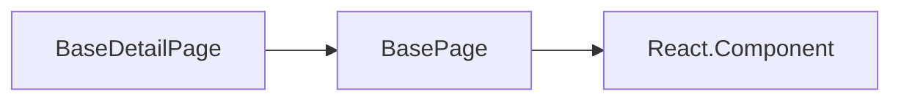

详情页，主要用于后台管理中功能较为通用的详情页。

## 最基本的用法

```ts
class Demo extends BaseDetailPage<IBaseDetailPageProps, IBaseDetailPageState> {
  constructor(props: IDetailsProps) {
    super(props);
    this.state = {
      title: "页面标题",
      queryAction: () => {
        return http.get("请求地址", {
          params: { id: this.props.match.params.id },
        });
      },
      dataSource: {}, // 后端返回接口数据
    };
  }

  render() {
    return super.render({
      body: <UdDetail dataSource={{}} items={[]} />,
      footer: (
        <ButtonGroup>
          <Button>返回</Button>
        </ButtonGroup>
      ),
    });
  }
}
```

## 继承关系



组件继承 `BaseDetailPage` 后，可根据需求配置 `state` 内的属性，具体属性可见如下 API 说明

## 子类可用成员

- ### handleDataSource，query 成功后处理数据

  ```ts
     protected queryParams = (res: any)=>{
       return res
     }
  ```

  在某些特殊情况下拿到后端数据接口后需要做特殊的处理可通过重写该方法来实现

## API

<!-- ud-ts("index.tsx", "IBaseDetailPageState") -->

## 例子

---

<!-- ud-demo("标准用法", "最基本的详情页", "demos/basic.tsx") -->

<!-- ud-demo("扩展用法", "可通过属性配置改变每一个需展示内容每一行的占比、可配置返回参数", "demos/extend.tsx") -->
