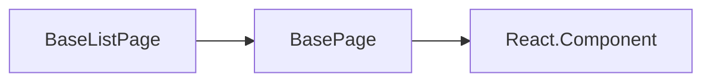

基础列表页，主要用于后台管理中功能较为通用的列表页。

## 基本用法

```ts
class Demo extends BaseListPage<IBaseListPageProps, IBaseListPageState> {
  constructor(props: IDemoProps) {
    super(props);
    this.state = {
      title: "页面标题",
      queryApi: "后端接口地址",
      conditions: [], // 筛选条件配置
      columns: [], // 列表配置
    };
  }
}
```

## 继承关系



组件继承 `BaseListPage` 后，可根据需求配置 `state` 内的属性，具体属性可见如下 API 说明

## 类的泛型参数

- P ：Props，必须继承与 `IBaseListPageProps` ，默认值 `IBaseListPageProps`。
- S ：State，必须继承与 `IBaseListPageState` ，默认值 `IBaseListPageState`。
- QP ：QueryParams 类型，必须继承与 `IListQueryParams` ，默认值 `IListQueryParams`。

## 子类可用成员

- ### defaultQueryParams，默认查询参数

  ```ts
     protected defaultQueryParams: QP = {} as QP
  ```

  - 没有设置默认值的参数，即便 url 有传入值，也无法通过 `this.queryParams` 获取。
  - 设置参数默认值的类型，决定了此参数的数据类型。
  - 数据类型支持：string、boolean、number、object、function。`暂不支持数组`。

  > boolean：1、'1'、'true' 都将转换为 true，0、'0'、'false' 都将转换为 false

  > number：支持小数、负数

  > object：支持多层嵌套

  > function：可用于参数自定义处理逻辑

- ### queryParams，获取查询参数

  ```ts
  protected queryParams: QP = {} as QP
  ```

  该参数可获取即将查询的数据

* ### getQueryParams，获取查询参数

  ```ts
  protected getQueryParams = () => {
  /**
    * this.queryParams 获取查询参数可见上文
    */
    const params = this.queryParams
  /**
    * 返回接口请求参数即可
    */
    return { }
  }
  ```

  当查询参数的比较特殊时可以用该方法获取并更改即将调用接口的参数

* ### baseQueryParams，固定参数

  ```ts
  protected baseQueryParams: Store = {}
  ```

  设置类该参数会在查询条件上默认带上,具体可打开开发者工具看 Network

  ```ts
  protected baseQueryParams = {
    a: '这是固定参数'
  }
  ```

* ### handleDataSource，处理接口返回的数据

  ```ts
  protected handleDataSource = (data: any, res: AxiosResponse<IListRes<any>>) => {
    return data
  }
  ```

  在某些情况下后端返回的数据需我们处理一下某些字段时可通过该方法去更改

* ### filterForm，条件过滤器的表单对象

  ```ts
  protected filterForm: FormInstance = {} as FormInstance
  ```

  该属性可以获取 antd 表单的对像从而可以对筛选组件的 form 做一些特殊的处理

  ```ts
  /**
   * getFieldValue 为antd表单获取对应字段名的值具体可看antd 的Form文档
   */
  this.filterForm.getFieldValue("name");
  ```

## API

### 配置参数

<!-- ud-ts("typings.tsx", "IBaseListPageState") -->

## 例子

> 下面例子调用的接口均为 mock 数据，暂时不支持条件过滤，可以通过观察网络请求判断求条件是否正常传递。

> 下面例子中都使用了 saveParamsWithUrl、useHeaderAffix 参数，仅为了示例效果设置，请根据实际情况选择是否使用这些参数。

---

<!-- ud-demo("标准用法", "标准列表页配置", "demos/basic.tsx") -->

<!-- ud-demo("render插槽", "根据需求可通过插槽方式自定义页面一部分样式", "demos/slot.tsx") -->

<!-- ud-demo("使用子类方法", "有的需求查询条件和接口返回列表数据比较特殊需做特殊处理", "demos/query.tsx") -->

<!-- ud-demo("使用深度分页模式", "使用深度分页器的基础列表页，只展示上一页下一页", "demos/sequencePager.tsx") -->

<!-- ud-demo("可勾选", "可以勾选列表数据", "demos/selectable.tsx") -->

